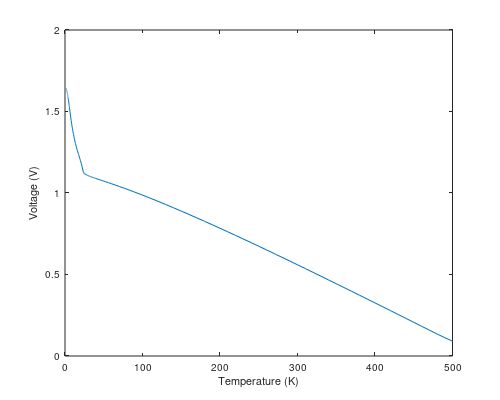

# Take Home Problem: Map Voltages to Temperatures and Back

A problem is presented with the following requirements:

1. Create an object with two functions, `convertmVtoK` and `convertKtomV`
2. The object can have an expensive constructor, but its convert methods must perform well in an embedded system
3. Demonstrate good OOP principles

The convert methods are intended to convert between voltage and temperature values to support a thermal sensor. That sensor is expected to have a well-measured but non-linear response, similar to:



The converter should be expected to have on the order of 100 calibration points provided to describe the response curve.

## Assumptions

First, a few assumptions are made:

1. Linear interpolation between calibration points is acceptable.
2. The converter must accurately respond across the entire temperature range, 0-500 K.
3. The converter should extrapolate values that are beyond calibration points.
   - A consequence of this decision is the converter can return some nonsense values such as numbers below absolute zero.
   - Error codes or exceptions could also be used. The correct choice would likely be found be engaging with stake holders to clarify edge conditions.

## Solution

This repo works the problem by:

1. Using strongly typed objects to handle measurement values.
   - This takes advantage of the C++ type system to ensure no accidents happen where a measurement of, for example, volts, are accidentally saved as kelvin. The types also protect against accidentally treating a "volt" value as a "millivolt" measurement.
2. Wrapping the type safe implementation in a class that provides the methods requested in the problem statement (`convertmVtoK` and `convertKtomV`).
   - These methods forward to the type safe implementation using something like:
      ```c++
      double convertmVtoK(double millivolts) { return units::unit_cast<double>(convert(millivolts_t(millivolts))); }
      double convertKtomV(double kelvin) { return units::unit_cast<double>(convert(kelvin_t(kelvin))); }
      ```
3. Using the Inversion of Control pattern to configure the converter.
   - This allows the calibration points to come from any source--they can be hard coded as they appear in the unit tests, or they can be imported from a file as they appear in the example program.
4. Putting the converter behind an interface class. This continues the Inversion of Control, allowing the converter to be used in a larger system while leaving that system easily testable by stubbing out the converter.
5. Storing the calibration points as two vectors: one sorted by voltages, another sorted by temperatures. When converting from one measurement to the other, the input measurement's list is searched using a std library function with log(N) performance. The closest two calibration points are chosen and linear interpolation between those points is used to determine the expected output measurement.

## Verification

The solution using some GTest unit tests to verify expected behaviors.

## 3rd Party Libraries

This code makes use of some pretty great libraries to help with parsing the input file and ensuring unit values are handled correctly. Boost was left out just because how painful it can be to include boost. I always find it a pain setting up where boost is installed. The 3rd party libraries used in this project are nice and simple enough that they can be added as subtrees to the repo.

### Units
https://github.com/nholthaus/units

This units library is _super_ cool, handling conversions not only between different scales, e.g.,
```c++
volt_t volts(1.0);
millivolt_t millivolts = volts;
std::cout << to_string(millivolts) << std::endl; // "1000 mV"
```

but going as far as understanding how to combine different unit types, e.g.,
```c++
second_t seconds(13.2);
feet_t feet(412.0);
knots_t = feet / seconds;
std::cout << to_string(knots_t) << std::endl; // "18.492676 kts"
```

### JSON
https://github.com/nlohmann/json

This library makes working with JSON in C++ almost painless.

### GTest
https://github.com/google/googletest

A very powerful test/mocking framework. The only complaint I've had with gtest code is that years ago they messed up their terminology (see: [their primer](https://github.com/google/googletest/blob/master/googletest/docs/primer.md#beware-of-the-nomenclature)).